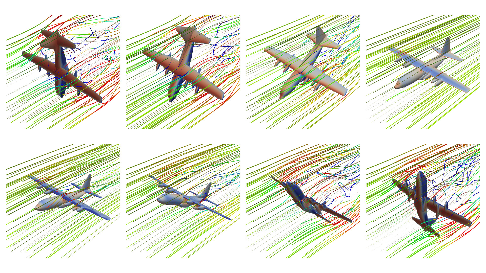
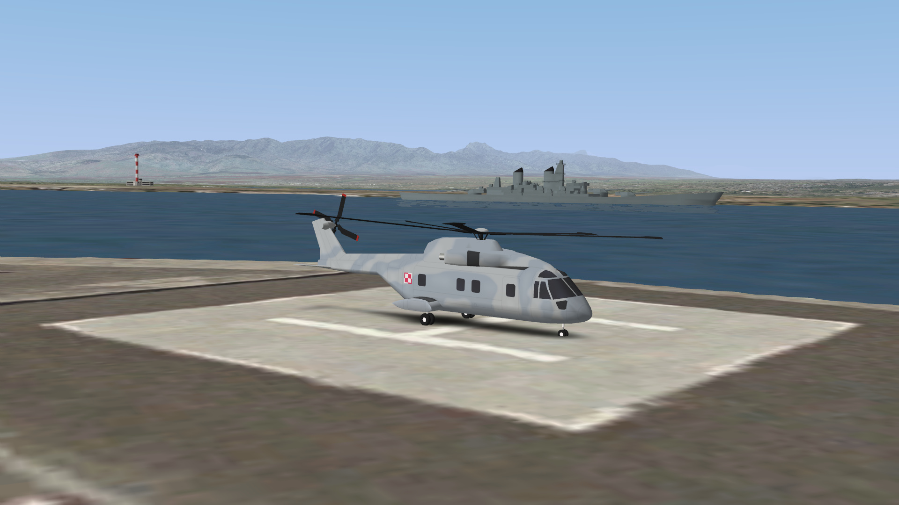
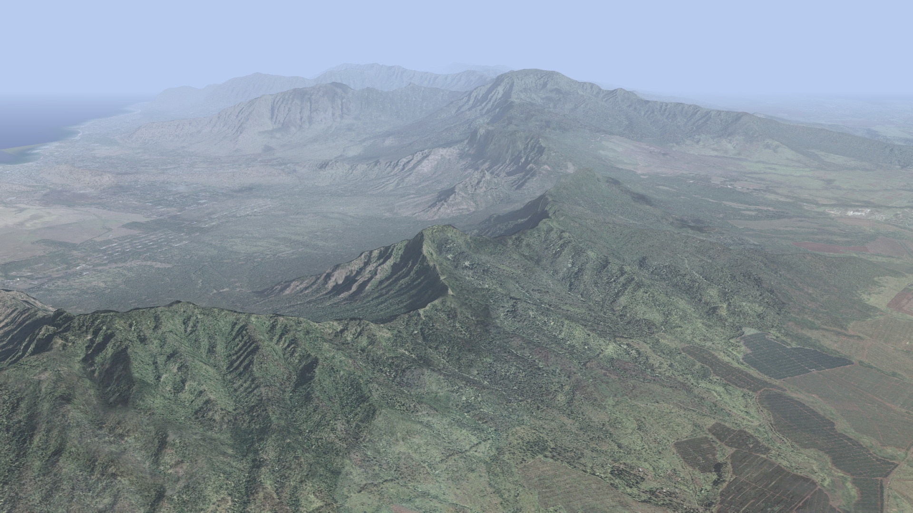
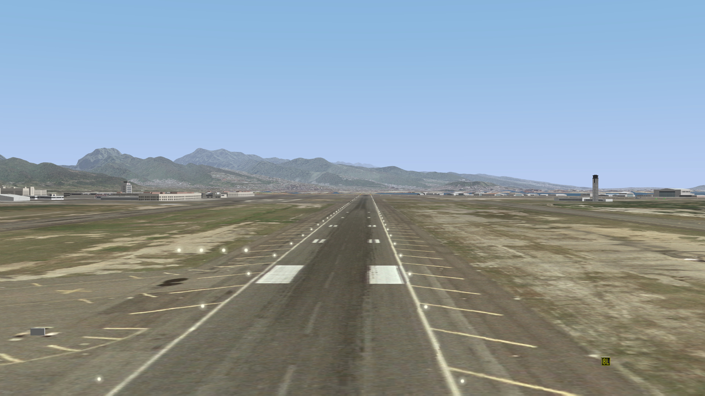
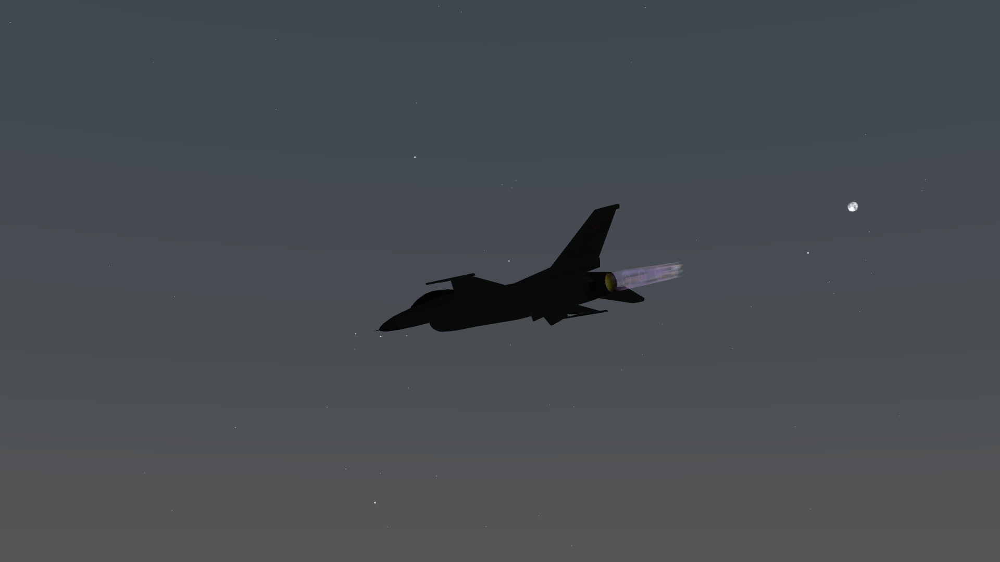
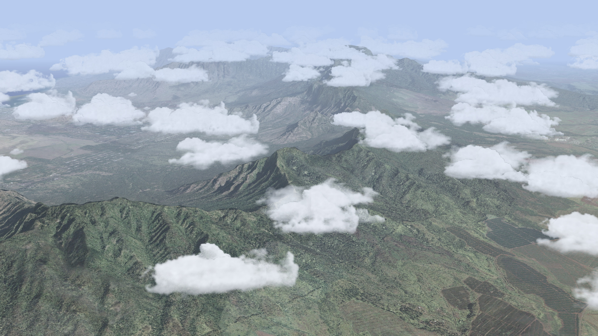

# MScSim

Simple flight simulator.

## Installation

### Linux

Linux [dpkg package](https://github.com/marek-cel/mscsim/releases/download/0.4/mscsim_0.4_focal_amd64.deb) is provided for Ubuntu 20.04 LTS / LinuxMint 20.x.

Additional data packages dependencies are required:

* [mscsim-data](https://github.com/marek-cel/mscsim-data/releases/download/0.4/mscsim-data_0.4_focal_all.deb)
* [mscsim-data-terrain](https://github.com/marek-cel/mscsim-data-terrain/releases/download/0.1/mscsim-data-terrain_0.1_focal_all.deb)

### Windows

Windows [installer](https://github.com/marek-cel/mscsim/releases/download/0.4/mscsim-0.4-win64.exe) is provided. It contains all necessary data.

## Building from source

### Dependencies

MScSim requires following library dependencies:

* [libxml2](http://www.xmlsoft.org/)
* [OpenAL](https://www.openal.org/) and [ALUT](https://github.com/vancegroup/freealut)
* [OpenScneGraph](http://www.openscenegraph.org/)
* [Qt5](https://www.qt.io/)

#### Linux

Additional library dependencies on Linux:

* libX11
* libXss

On Ubuntu based Linux distributions those dependencies can be installed with the following command:

```apt install libalut-dev libopenal-dev libopenscenegraph-dev libqt5opengl5-dev libqt5svg5-dev libqt5x11extras5-dev libqwt-qt5-dev libxml2-dev libx11-dev libxss-dev qtbase5-dev```

#### Windows

On Windows those dependencies have to be installed manually.

You can download source files and/or binaries of this dependencies from:

* [https://openal.org/downloads/](https://openal.org/downloads/)
* [https://github.com/vancegroup/freealut](https://github.com/vancegroup/freealut)
* [http://www.openscenegraph.org/index.php/download-section](http://www.openscenegraph.org/index.php/download-section)
* [https://download.qt.io/archive/qt/](https://download.qt.io/archive/qt/)

Please notice that OpenSceneGraph has also its own third party dependencies wich need to be installed.

### Building using CMake

To build MScSim generate project files with CMake in ```src``` directory, then use appropriate building system, e.g. Makefile on Unix-like operating systems or MS Visual on Windows.

### Building using qmake

As an alternative, MScSim can be built with ```qmake``` tool. Run qmake on ```mscsim.pro``` file and then use appropriate building system. You can also use Qt Creator.

On Windows operating systems environment variables ```ALUT_DIR```, ```OPENAL_DIR``` and ```OSG_ROOT``` have to be set and point directories containing header and binary files of the ALUT, OpenAL and OpenSceneGraph.

## Main features

High fidelity flight dynamics model based on available wind tunnel data and/or [CFD](https://en.wikipedia.org/wiki/Computational_fluid_dynamics) simulations using [OpenFOAM](https://www.openfoam.com/) and [OpenVSP](https://software.nasa.gov/featuredsoftware/openvsp).



Available following aircraft types:

* [AW101](https://en.wikipedia.org/wiki/AgustaWestland_AW101) - medium helicopter
* [C-130](https://en.wikipedia.org/wiki/Lockheed_C-130_Hercules) - turboprop transport aircraft
* [Cessna 172](https://en.wikipedia.org/wiki/Cessna_172) - general aviation aircraft
* [F-16](https://en.wikipedia.org/wiki/General_Dynamics_F-16_Fighting_Falcon) - 4th generation jet fighter
* [F-35A](https://en.wikipedia.org/wiki/Lockheed_Martin_F-35_Lightning_II) - 5th generation jet fighter
* [Mustang Mk III](https://en.wikipedia.org/wiki/North_American_P-51_Mustang) - World War II era fighter
* [PW-5](https://en.wikipedia.org/wiki/PW-5) - World Class glider
* [R44](https://en.wikipedia.org/wiki/Robinson_R44) - light helicopter
* [UH-60](https://en.wikipedia.org/wiki/Sikorsky_UH-60_Black_Hawk) - medium helicopter



Electronic Flight Instrument System and Head-up Display common for all aircraft types. Built-in map with navigational radio aids, airports, etc..


High resolution photorealistic scenery based on aerial imagery of Oahu island, low resolution scenery based on satellite imagery of the whole World.





Accurate celestial bodies position with almost 1000 visible stars.



Weather phenomena, such as clouds and fog.




## See also

* [mscsim-cfd](https://github.com/marek-cel/mscsim-cfd)
* [mscsim-data](https://github.com/marek-cel/mscsim-data)
* [mscsim-data-terrain](https://github.com/marek-cel/mscsim-data-terrain)
* [mscsim-docs](https://github.com/marek-cel/mscsim-docs)

Visit [http://marekcel.pl/mscsim](http://marekcel.pl/mscsim) for more information.
