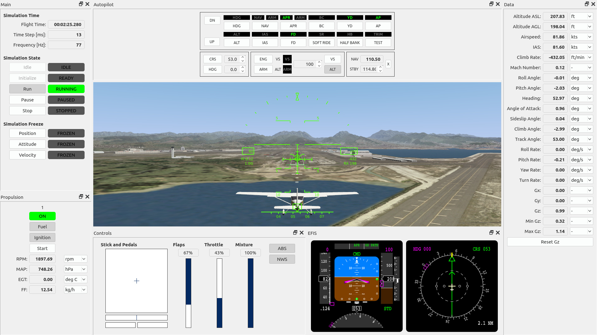
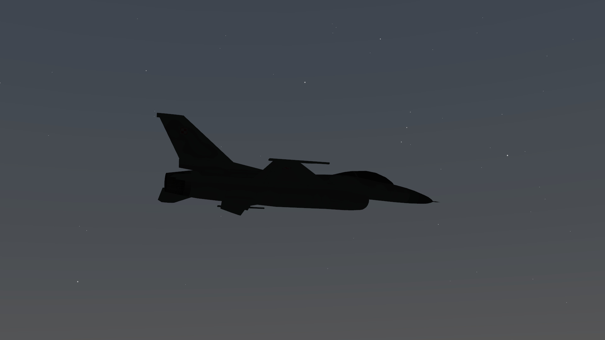
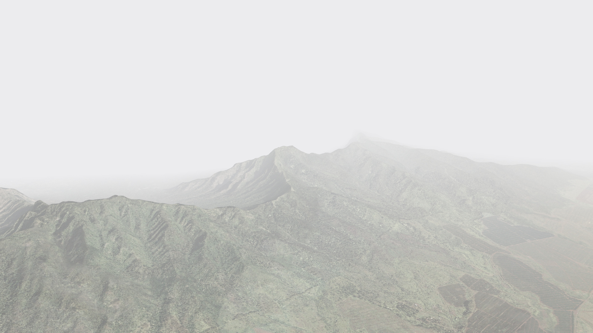

# mscsim
Flight simulation software.

## Main features:

High fidelity flight dynamics model based on available wind tunnel data and/or [CFD](https://en.wikipedia.org/wiki/Computational_fluid_dynamics) simulations including following aircraft types:

* [AW101](https://en.wikipedia.org/wiki/AgustaWestland_AW101) - medium helicopter
* [C-130](https://en.wikipedia.org/wiki/Lockheed_C-130_Hercules) - turboprop transport aircraft
* [Cessna 172](https://en.wikipedia.org/wiki/Cessna_172) - general aviation aircraft
* [F-16](https://en.wikipedia.org/wiki/General_Dynamics_F-16_Fighting_Falcon) - 4th generation jet fighter
* [F-35A](https://en.wikipedia.org/wiki/Lockheed_Martin_F-35_Lightning_II) - 5th generation jet fighter
* [Mustang Mk III](https://en.wikipedia.org/wiki/North_American_P-51_Mustang) - World War II era fighter
* [R44](https://en.wikipedia.org/wiki/Robinson_R44) - light helicopter
* [UH-60](https://en.wikipedia.org/wiki/Sikorsky_UH-60_Black_Hawk) - medium helicopter

Electronic Flight Instrument System and Head-up Display common for all aircraft types. Built-in map with navigational radio aids, airports, etc..

High resolution photorealistic scenery based on aerial imagery of Oahu island, low resolution scenery based on satellite imagery of the whole World.

Accurate celestial bodies position with almost 1000 visible stars.

Weather phenomena, such as clouds and fog.

Visit [http://marekcel.pl/mscsim](http://marekcel.pl/mscsim) for more information.

## See also:
- [mscsim-cfd](https://github.com/marek-cel/mscsim-cfd)
- [mscsim-data](https://github.com/marek-cel/mscsim-data)
- [mscsim-docs](https://github.com/marek-cel/mscsim-docs)
- [mscsim-tools](https://github.com/marek-cel/mscsim-tools)
